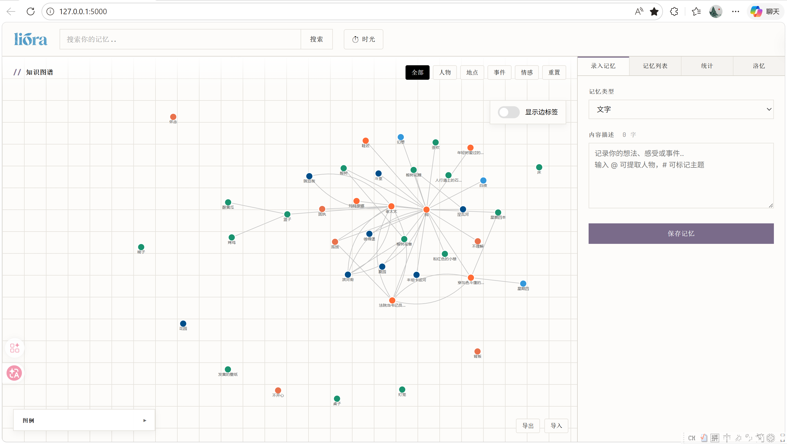
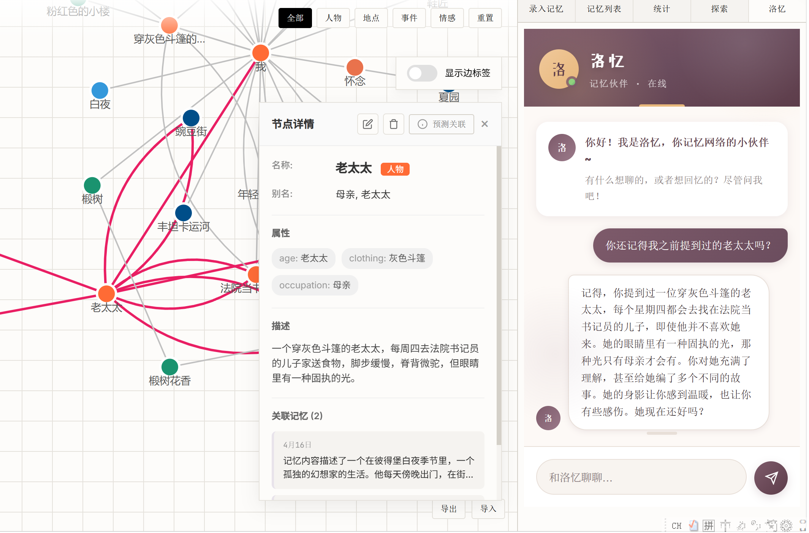
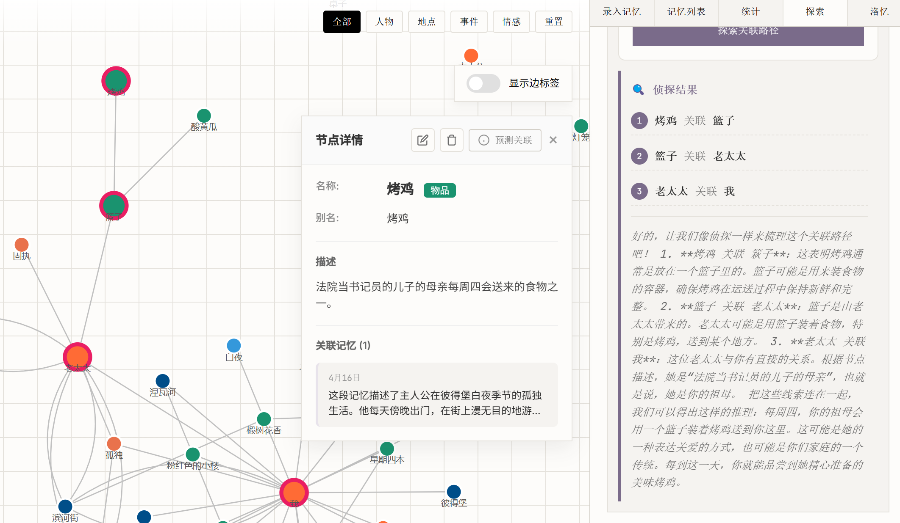
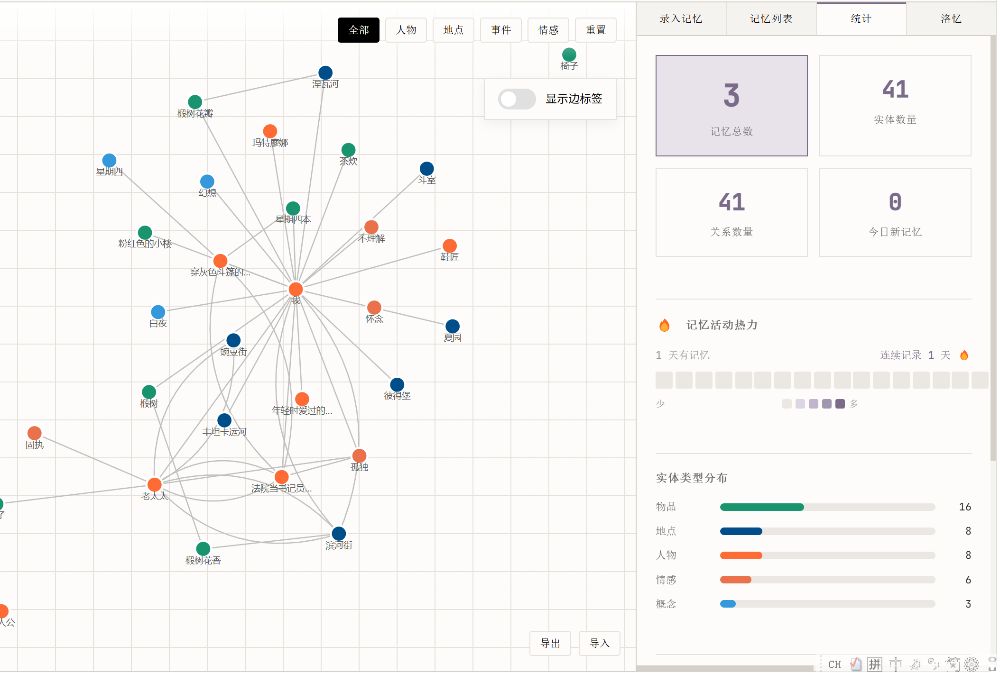
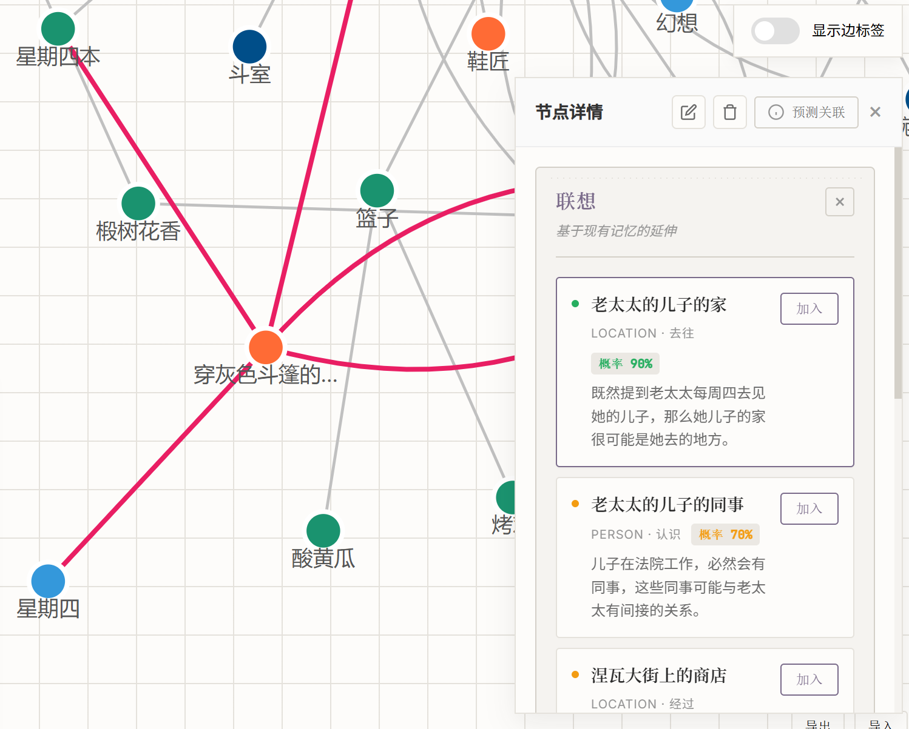
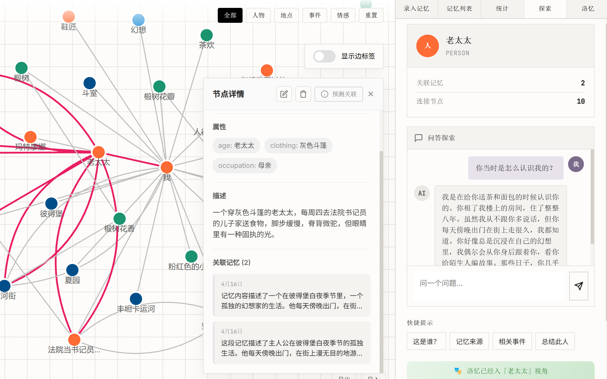

# Liora · 个人知识图谱 | AI 记忆联网 | RAG 第二大脑

<p align="center">
  <strong>语言 / Language</strong>:
  <a href="README-en.md">English</a> |
  <a href="README.md">简体中文</a>
</p>

<p align="center">
  
</p>

<p align="center">
  <a href="#"></a>
  <a href="#"></a>
  <a href="#"></a>
  <a href="#"></a>
  <a href="#"></a>
  <a href="#"></a>
  <a href="#"></a>
  <a href="#"></a>
  <a href="#"></a>
</p>

<p align="center">
  <b>Liora</b> 不是日记本，而是你的 <b>“第二大脑”</b>。<br>
  从碎片到图谱，从遗忘到预知 —— 让每一次记录都成为未来灵感的伏笔。
</p>

---

## 🧠 核心理念

> **"Remember well. Connect everything."**
> **记得清晰，连接万物。**

Liora 重新定义记忆的方式。不是简单的日记，不是孤立的关系图谱——而是**活的、互联的、不断生长的记忆网络**。

上传一段文字、一张照片、一段录音，AI 自动解析其中的实体与关系，织成一张属于你的知识图谱。跨越时间、空间、情感的维度，帮你发现记忆之间那些隐秘却动人的联系。

🔒 **隐私优先 · Local-First 架构**：你的数据全量存储在浏览器 IndexedDB 中，服务端仅作为 AI API 的无状态代理，不落盘任何用户数据。

---

## 📸 功能预览

<p align="center">
  
  
</p>

<p align="center">
  
  

</p>

<p align="center">
  
  
</p>

---

## 🚀 快速开始

```bash
# 克隆仓库
git clone https://github.com/belaViro/Liora.git && cd Liora

# 安装依赖
pip install -r requirements.txt

# 配置 .env (填入你的 API Key)
cp .env.example .env

# 启动项目
python app.py
```

🌐 启动后打开浏览器访问 [http://localhost:5000](http://localhost:5000)

---

## ⚡ 功能矩阵

| 功能模块 | 一句话简介 |
|:-----|:-----|
| 🕸️ **知识图谱** | D3.js 力导向图谱，可视化你的“思维神经元” |
| 📝 **多模态录入** | 文字/图片/音频，AI 瞬间解析实体与隐秘关联 |
| 🔍 **混合搜索** | 浏览器端余弦相似度 + 关键词混合搜索，既懂语义又懂精准 |
| 📅 **记忆探索** | 沿时间线顺藤摸瓜，还原完整故事链 |
| 🃏 **记忆卡片** | 复古档案风格，一键导出 PNG 珍藏 |
| 🤖 **AI 洛忆** | 懂你情绪的智能伙伴，支持 SSE 流式输出与第一人称视角代述 |
| 📊 **统计面板** | 全局数据画像，洞察你的记忆构成 |
| 🔮 **智能预测** | 基于图谱拓扑，预言你可能遗忘的关联 |
| 🌐 **双语切换** | 支持中文 / English UI 文案与 AI 回复语言切换 |
| 📤 **.loyi 归档** | 完整备份与迁移，数据主权属于你 |

---

## 🕸️ 1. 知识图谱可视化

**D3.js 力导向引擎驱动**，将记忆网络以动态拓扑呈现。

- **沉浸式交互**：拖拽节点自动重排布，滚轮缩放观察全局与微观。
- **即时编辑**：点击节点或边即可修改关系类型、合并重复实体。
- **动态聚焦**：输入关键词，画布自动高亮并飞入目标节点。

> **场景**：梳理你与某位故友十年间的交集，图谱会告诉你：“原来你们曾因为那个冷门的乐队，在不同年份去过同一家 Livehouse。”

---

## 📝 2. 多模态记忆录入

**文字 / 图片 / 音频**，像发朋友圈一样记录，剩下的交给 AI。

- **文字录入**：支持 `@实体` 关联、`#标签` 分类。
- **图片上传**：OCR 提取图中文字，视觉模型理解场景。
- **音频录制**：浏览器端录音，自动转写与情感基调捕捉。

**AI 自动分析流水线：**

>输入内容 → [实体抽取] → [关系构建] → [情感打分] → [摘要生成] → [时间锚定]


---

## 🔍 3. 混合语义搜索

**告别”关键词匹配不到”的焦虑。**

- **语义检索**：搜索”那个下雨天”能匹配到”窗外湿漉漉的午后”。
- **关键词匹配**：确保专有名词不丢失。
- **结果融合**：余弦相似度 + 关键词双重打分排序，并标注”为什么这条记忆被找到”。

---

## 📅 4. 记忆探索 · 侦探视角

**从碎片到故事链，只需一个起点。**

1. 选中一段模糊的回忆或一个实体。
2. Liora 沿时间线双向追溯“往事”与“后来”。
3. 每一步跳转附带 **AI 推理依据**：*“因为你们都参加了那次聚会，所以推测后来你在同一地点认识了 C。”*

---

## 🃏 5. 复古记忆卡片

**将数字记忆封装为实体档案。**

- **美学设计**：米黄纸张纹理、打字机字体、圆形火漆印章式日期。
- **导出方式**：基于 `html2canvas` 渲染，完美像素导出 PNG。
- **社交属性**：这不仅是数据，更是可以发朋友圈的“故事切片”。

---

## 🤖 6. AI 洛忆 · 有温度的回应

**它不是客服，是知道你所有故事的旧友。**

| 情感雷达 | 洛忆的语气 |
|:---------|:---------|
| 😊 愉悦 (>0.3) | *“好家伙，这波回忆杀质量太高了，当时你一定很开心吧！”* |
| 😔 低落 (<-0.3) | *“抱抱，那段日子确实不容易，但你看，你都走过来了。”* |
| 😐 中性 | *“平凡的一天也值得被记住，毕竟这就是生活的底色啊。”* |

>**🎭 视角切换**：点击图谱中的人物节点，洛忆将**化身该人物**，用第一人称“我”来讲述你们之间的往事。

>**⚡ 流式输出**：洛忆聊天支持 SSE（Server-Sent Events）增量返回，回复生成时会逐段显示，不再等待整段回答完成。

---

## 7. 智能预测 · 第六感

**图谱有“盲区”，Liora 帮你补全。**

选中任意节点，系统分析：
- 该节点在图谱中的位置角色
- 相似节点通常连接什么类型的实体
- 沿关系路径可能延伸到的未知领域

>返回预测的 **新实体名 + 关系类型 + 预测理由**。

---

## 📤 8. .loyi 格式 · 数据主权

**你的记忆，必须完全属于你。**

`.loyi` 是一个标准的 ZIP 压缩包，内含：
- `manifest.json`：导出清单与元数据
- `memories/`：所有记忆原文及元数据 JSON
- `graph/`：NetworkX 格式的节点与边关系
- `attachments/`：原始图片与音频文件

> **一键迁移**：导入时智能比对哈希，自动跳过重复记忆。

---

## 🛠️ 部署与合规

- **SSH 运维**：适合通过 SSH 登录云服务器完成代码拉取、环境变量配置、服务重启与日志排查。
- **反向代理**：生产环境建议使用 Nginx / Caddy 托管 HTTPS，并确保 `text/event-stream` 不被代理缓存，保证洛忆 SSE 流式输出即时生效。
- **ICP备案**：面向中国大陆公网域名部署时，请按云服务商流程完成 ICP 备案，并在站点页面按要求展示备案号。

---

## ⚙️ 技术架构

```text
MemoryWeaver/
├── app.py                  # Flask 主应用 + SocketIO 实时通信
├── blueprints/             # 路由模块化
│   ├── memory.py          # 记忆 CRUD
│   ├── graph.py           # 图谱查询
│   ├── compute.py         # AI 计算端点（嵌入、理解、搜索排名）
│   ├── luoyi.py           # 洛忆聊天
│   ├── config.py          # 运行时配置
│   ├── stats.py           # 统计接口
│   └── export.py          # 导入导出
├── services/               # 后端服务
│   ├── llm_service.py     # 大模型统一调度（LLM + 嵌入）
│   ├── extraction_schema.py # AI 理解的结构化 Schema
│   └── temporal_extractor.py # 时间信息提取
├── static/
│   ├── css/               # 样式模块化
│   └── js/
│       ├── api/           # 前端 API 客户端
│       ├── db/            # IndexedDB + 向量搜索
│       └── services/      # 前端业务服务（记忆、图谱）
├── templates/              # HTML 模板
│   └── components/        # 可复用组件
├── data/                   # 样例数据
├── Dockerfile              # Docker 容器化部署
└── docker-compose.yml      # Docker Compose 编排
```


## 📅 更新日志

### v1.0.5 · 2026-07-01
- ✨ 新增洛忆聊天 SSE 流式输出，回复生成时逐段显示
- 🚀 优化生产环境 SSE 响应处理，避免 gzip / 代理缓存影响流式体验
- 🛠️ 补充 SSH 云服务器部署与运维说明
- 🧾 补充中国大陆公网部署的 ICP 备案合规说明

### v1.0.4 · 2026-04-30
- ✨ 新增中英文界面切换，支持 UI 文案与 AI 回复语言切换
- 📝 新增英文默认 README，并保留中文 README 入口

### v1.0.3 · 2026-04-16
- ✨ 新增洛忆聊天面板：AI 智能伙伴，支持情绪感知对话与第一人称视角
- ✨ 新增产品详情面板
- 🔌 后端模块化：`blueprints/luoyi.py` 洛忆聊天模块独立
- 🎨 前端模块化：洛忆面板 CSS/JS 独立拆分（luoyi-chat.css、product-info.css）
- 🐳 Docker 化部署支持，新增 Dockerfile

### v1.0.2 · 2026-04-13
- ✨ 新增 .loyi 导入导出功能
- 🔧 节点/边数据结构补充 created_at / updated_at / directed 字段
- 🎨 图谱控制栏右下角新增导出/导入按钮
- 🗑️ 移除录入面板多余的情感选择按钮

### v1.0.1 · 2026-04-12
- ✨ 新增智能预测服务（基于图谱结构的下一节点预测）
- 🎨 CSS 样式模块化重构（12 个独立样式文件）
- 🔧 优化图谱渲染性能，减少大规模节点卡顿
- 🐛 修复「历史上的今天」中文编码问题

### v1.0.0 · 2026-04-12
- 🎉 初始版本发布
- 多模态记忆录入（文字 / 图片 / 音频）
- AI 内容理解（实体抽取 · 关系抽取 · 情感分析）
- D3.js 知识图谱可视化
- 向量 + 关键词混合语义搜索
- 「历史上的今天」功能
- 复古风格记忆卡片导出
- AI 洛忆智能伙伴
- 统计面板

---

## Open to Opportunities
如果你对我的项目感兴趣，欢迎联系我！

[](mailto:bela_viro@outlook.com)


## License
This project is released under the **GNU Affero General Public License v3.0 (AGPL-3.0)**.

作为网络服务软件，如果你修改并部署了 Liora，你必须向访问该服务的用户提供修改后的完整源代码。

For the full license, see the [License](License) file.

<p align="center">
  <i>“时间会流逝，但织网永存。Remember well. Connect everything.”</i>
</p>